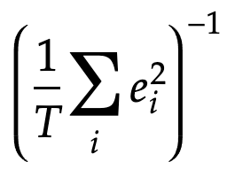

# Reinforcement Learning to find PID Parameter

This project represents a basic showcase of Python bindings for Simulink model binaries in computational demanding tasks.

A Simulink model of a Spring-Mass-Damper system controlled by a PID controller is the base of the showcase. Using [SliM-PyB](https://github.com/matamegger/slim-pyb), the model is converted to native binaries and the according Python bindings. 

## Reinforcement Learning Environment

The setup of the ML environment should most like be not seen as a best practice guide. It was created with limited knowledge and no previous experience.

In the environment the agent can give only one action for the simulation to be finished (static PID parameters). The action consists of the three control parameters of the PID controller (Kp, Ki, Kd).
Using the provided parameters a 50 seconds long simulation of the controlled Spring-Mass-Damper system is executed.
After the simulation the inverse normalized square of the error is used as the reward function of the agent.



(Where `e` is the error [difference between input and output signal] in the simulation step `i` and `T` the absolute number of steps)_


The inverse was needed, because otherwise the reward would sum up to very high numbers, which the RL library could not handle.

## Trained Model

The model in the project is trained with 150k `timesteps` mixed with a `step` and a `sinus` command value input.

## Prerequisits

Python3 as well as [`pipenv`](https://pypi.org/project/pipenv/) must be installed. The remaining dependencies should be automatically handled with the `Pipfile`s.

# Usage
_The pre-trained model `PID-Parameter-Model` will always be loaded if it exists in the filepath._

```
python3 main.py
```
Uses the model to get the PID parameters and plots a step response of the system.

Providing `sin` as an argument (`python3 main.py sin`) will use a sinus input function instead of the step.

To also train the model before showing a system response `-t` must be provided as a command line argument.
Trainings always run for 25k timesteps and will override the model on disk.
